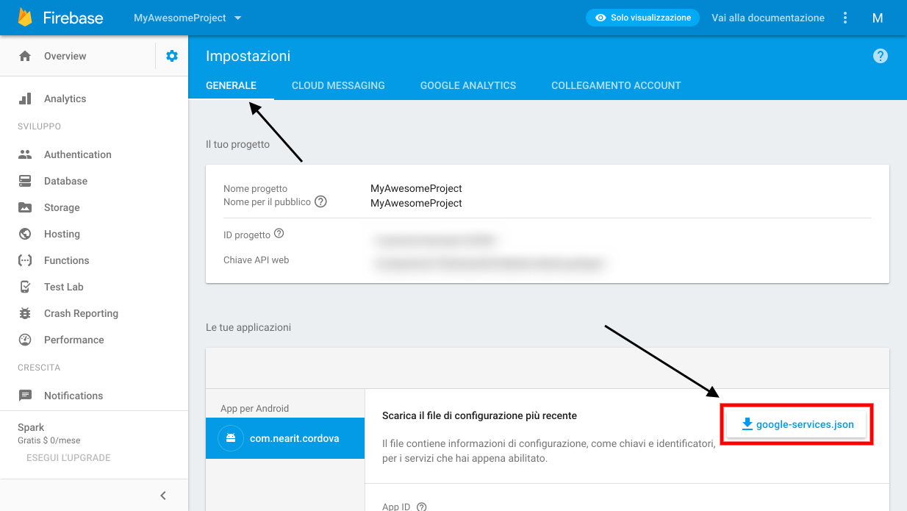
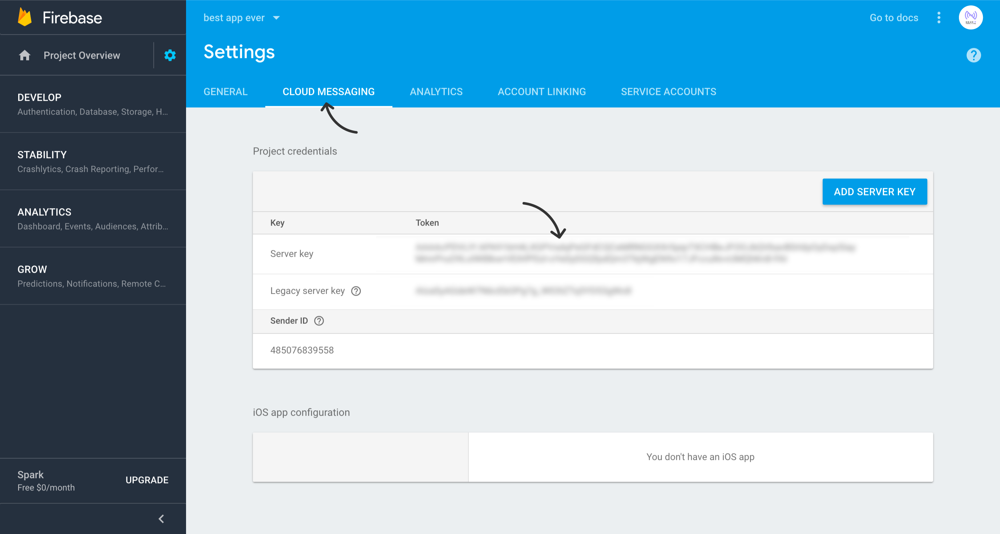

# Push Notifications

To enable push notification you will need to integrate **Google Firebase** in your app:
<br><br>
**1.** If you don't already have a **Firebase project**, create one at <a href="https://console.firebase.google.com/" target="_blank">**Google Firebase Console**</a>.<br>
Inside the project, select **"Add Firebase to your Android app"** (make sure to enter the right package name of your app).
<br><br>
**2.** Download `google-services.json` file to your computer and
copy it in your **app module** root folder (not in the project root folder!).

<br><br>
**3.** Copy your project ***FCM Cloud Messaging Server Key*** from <a href="https://console.firebase.google.com/" target="_blank">**Google Firebase Console**</a>
(See the screenshot below and make sure to use the right api key)


<br>
**4.** Add the right dependency in your root-level build.gradle file:
```xml
buildscript {
    // ...
    dependencies {
        // ...
        classpath 'com.google.gms:google-services:3.1.1' // google-services plugin
    }
}
```

Then, enable the plugin in your module Gradle file (usually the app/build.gradle):
```xml
apply plugin: 'com.android.application'

android {
  // ...
}

dependencies {
  // ...
}

// ADD THIS AT THE BOTTOM
apply plugin: 'com.google.gms.google-services'
```
<br><br>
**5.** Open [NearIT](https://go.nearit.com), select your app and navigate to **“Settings > Push Settings”**.
Paste your project FCM Key under the **“Setup Android push notifications”** block.

<br><br>
___
**WARNING**: Do not follow any further FCM-specific instructions: we automatically handle all the other part of the process inside the SDK code.
___


<br>
The SDK creates a system notification for every push recipe it receives.
On the notification tap, your launcher activity will start.
To learn how to deal with in-app content once the user taps on the notification, see this [section](in-app-content.md).

If you want to customize your notifications, see this [section](custom-bkg-notification.md).


___
**WARNING**: If you experience build or runtime problems with google play services components, make sure to include the 11.6.0 version of any gms dependency in your app. Example:
```xml
compile 'com.google.android.gms:play-services-analytics:11.6.0'
```
Conflicting play services version may result in compile-time and run-time errors.
