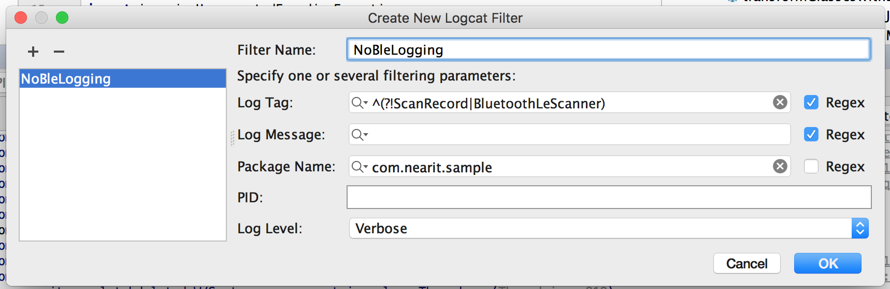

## Logging

If you are scanning beacons you have probably noticed the flood of logging messages, with either the `ScanRecord` or the `BluetoothLeScanner` tag. Those logs are created by the operating system and are due to always appear when doing BLE scans. To stop them from appearing in the logcat stream, create a custom filter and filter the two tags with a regex. Here is a screenshot of our filter.

The SDK itself produces logs for various events. Without specific configuration it uses the Android system logs, but you can set your own logger with the method:

NearLog.setLogger(new NearLogger() {
    // various methods to override
});

NearLog.setLogger(object : NearLogger {
    // various methods to override
})

